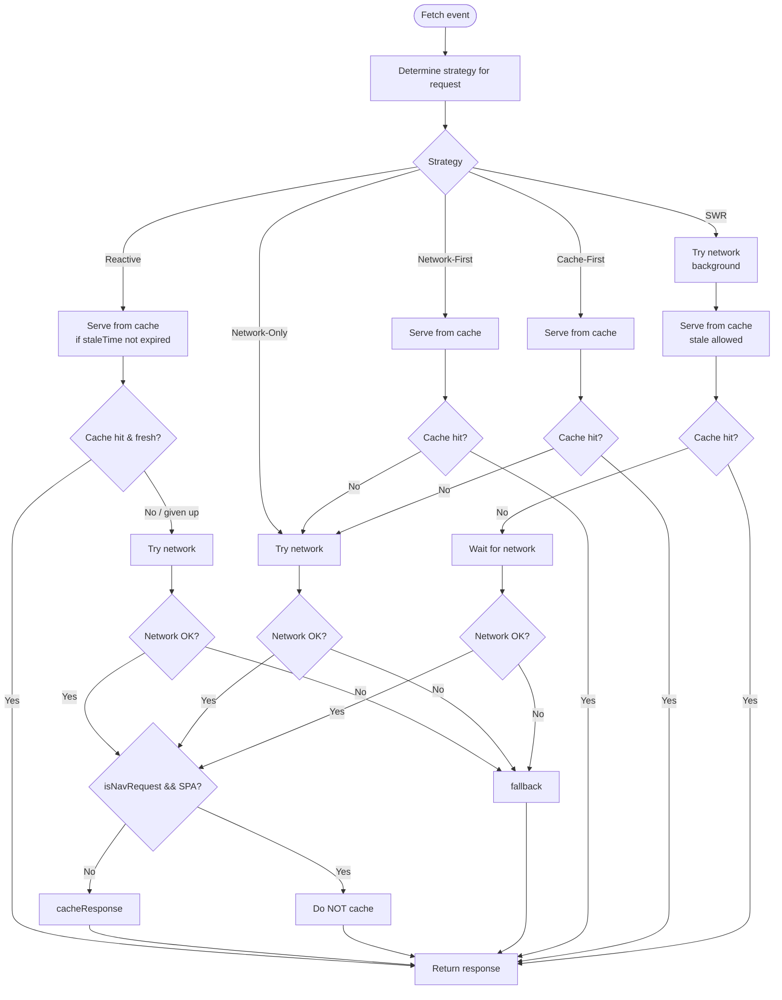
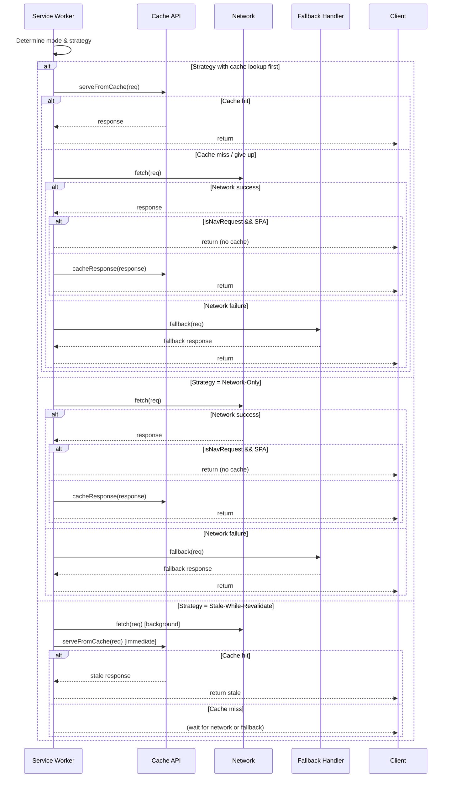

# Service Worker Caching Architecture – Complete Technical Reference

This document describes a **service worker caching architecture** designed to handle both **SPA**, **SSR**, and generic web applications. It defines a composable set of caching strategies, navigation detection, content‑type aware caching, and a fallback hierarchy that guarantees offline resilience.

---

## 1. Overview

The architecture is built around three core functions and one navigation detection predicate:

- **`isNavRequest(request)`** – Determines if a fetch event is a top‑level navigation.
- **`serveFromCache(request)`** – Looks up a request in precache or runtime caches, with mode‑specific rules for navigation requests.
- **`cacheResponse(response, request)`** – Stores responses based on `content‑type` and cache type (precache / runtime‑html / runtime).
- **`fallback(request)`** – Returns an offline / error page according to mode and route‑specific rules.

These are combined into **5 explicit caching strategies** (Reactive, Network‑Only, Network‑First, Cache‑First, Stale‑While‑Revalidate) plus an implicit **Cache‑Only** behaviour (when `serveFromCache` succeeds and network is never attempted). All strategies reuse the same building blocks.

The architecture also distinguishes **three application modes** – `SPA`, `SSR`, `Default` – which alter how navigation requests are handled in `serveFromCache` and `fallback`.

---

## 2. Core Concepts

| Concept                | Description                                                                                |
| ---------------------- | ------------------------------------------------------------------------------------------ |
| **Precache**           | Versioned assets (JS, CSS, fonts, etc.) installed at service worker install time.          |
| **Runtime cache**      | Dynamically cached responses (API data, images, etc.).                                     |
| **Runtime‑html**       | Separate cache bucket for HTML responses generated by an SSR server.                       |
| **staleTime**          | Maximum age before a cached response is considered stale (used only in Reactive strategy). |
| **isNavRequest**       | `true` for `mode: 'navigate'` or `destination: 'document'` GET requests.                   |
| **Global fallback**    | Usually `index.html` (SPA shell) or a generic offline page.                                |
| **Per‑route fallback** | Custom offline pages for specific URL patterns (e.g., `/help` → `offline-help.html`).      |

---

## 3. Core Functions

### 3.1 `isNavRequest(request)`

```javascript
function isNavRequest(request) {
  return (
    request.mode === "navigate" ||
    request.destination === "document" ||
    (request.method === "GET" &&
      request.headers.get("sec-fetch-mode") === "navigate")
  );
}
```

**Mermaid flow:**

```mermaid
flowchart TD
    A[isNavRequest(request)] --> B{request.mode === 'navigate'?}
    B -- Yes --> C[return true]
    B -- No --> D{request.destination === 'document'?}
    D -- Yes --> C
    D -- No --> E{GET && sec-fetch-mode = navigate?}
    E -- Yes --> C
    E -- No --> F[return false]
```

### 3.2 `serveFromCache(request)`

Behaviour depends on **application mode** and `isNavRequest(request)`.

#### Mode: `SPA`

| isNavRequest? | Action                                                                       |
| ------------- | ---------------------------------------------------------------------------- |
| `true`        | **Bypass cache** → directly return global fallback (`index.html`) or give up |
| `false`       | 1. precache → 2. runtime → 3. give up                                        |

#### Mode: `SSR` or `Default`

| isNavRequest? | Action                                     |
| ------------- | ------------------------------------------ |
| `true`        | 1. precache → 2. runtime‑html → 3. give up |
| `false`       | 1. precache → 2. runtime → 3. give up      |

> `Default` mode behaves identically to `SSR` for navigation requests – this is intentional to support hybrid apps.

### 3.3 `cacheResponse(response, request)`

- Extract `content-type` header.
- If the response already exists in **precache** **and** the content‑type matches → **update** the precache entry.
- Else:
  - If `content-type` is `text/html` → store in **runtime‑html** cache.
  - Otherwise → store in **runtime** cache (or precache for static assets).
- Non‑HTML responses are always updated or added regardless of existence.

```mermaid
flowchart TD
    A[cacheResponse(response, request)] --> B[Extract content-type]
    B --> C{In precache with same type?}
    C -- Yes --> D[Update precache entry]
    D --> E[Done]
    C -- No --> F{Is content-type = HTML?}
    F -- Yes --> G[Store in runtime‑html]
    F -- No --> H[Store in runtime cache]
    G --> E
    H --> E
```

### 3.4 `fallback(request)`

| Mode        | Order of fallback sources                                      |
| ----------- | -------------------------------------------------------------- |
| **SPA**     | 1. per‑route fallback → 2. inline 503/504 HTML                 |
| **SSR**     | 1. per‑route fallback → 2. global fallback → 3. inline 503/504 |
| **Default** | 1. per‑route fallback → 2. global fallback → 3. inline 503/504 |

---

## 4. Caching Strategies

All strategies are defined using a decision tree that references the functions above.

### 4.1 Reactive

1. **Serve from cache** (if `staleTime` not expired). If cache hit and fresh → return.
2. If cache miss / expired → **Try network**.
3. On network success → if `isNavRequest && SPA` is true → **do not cache**; otherwise `cacheResponse`.
4. On network failure → **Fallback**.

### 4.2 Network‑Only

1. **Try network**.
2. On success → same caching rule (skip if `isNavRequest && SPA`).
3. On failure → **Fallback**.

### 4.3 Network‑First

1. **Serve from cache** (no freshness check). If hit → return.
2. If cache miss → **Try network**.
3. On success → cache (with same conditional skip) → return.
4. On failure → **Fallback**.

### 4.4 Cache‑First

1. **Serve from cache**.
2. If cache hit → return.
3. If cache miss → **Try network** → cache (conditional) → return.
4. On network failure → **Fallback**.

### 4.5 Stale‑While‑Revalidate (SWR)

1. **Try network** in the background (non‑blocking).
2. Immediately **Serve from cache** (allow stale response).
3. If cache hit → return stale response immediately.
4. If cache miss → wait for network (or fallback if network fails).
5. On network success → cache (conditional) for next time.

### 4.6 Cache‑Only (implicit)

- Simply call `serveFromCache` and return if found; otherwise go to fallback.
- Used for resources that should never hit the network (e.g., offline‑only assets).

---

## 5. Strategy Resolution Flow (Unified)

The following Mermaid diagram shows how each strategy is resolved, including the **conditional caching** rule (`isNavRequest && SPA`).



---

## 6. Mode‑Specific Behaviour Summary

The table below shows what happens for a **navigation request** (`isNavRequest === true`) in each mode and strategy.

| Mode    | Strategy      | Effective behaviour for navigation                                                                |
| ------- | ------------- | ------------------------------------------------------------------------------------------------- |
| SPA     | Any           | `serveFromCache` returns fallback immediately → no cache lookup → network only if fallback absent |
| SSR     | Reactive      | Cache (precache → runtime‑html) → network → fallback                                              |
| SSR     | Network‑First | Cache → network → fallback                                                                        |
| SSR     | Cache‑First   | Cache → network (only on miss) → fallback                                                         |
| SSR     | Network‑Only  | Network → fallback (cache only on success, but navigation success is rare offline)                |
| SSR     | SWR           | Network (background) + cache (stale) → fallback                                                   |
| Default | (same as SSR) | Same as SSR                                                                                       |

For **non‑navigation requests** (images, API, CSS, etc.), the mode has **no effect** – all strategies behave identically across SPA, SSR, and Default, because the `isNavRequest && SPA` condition is false.

---

## 7. Content‑Type Handling Details

`cacheResponse` implements the following rules:

| Content‑Type                                          | Cache destination | Update behaviour                                                                         |
| ----------------------------------------------------- | ----------------- | ---------------------------------------------------------------------------------------- |
| `text/html`                                           | `runtime-html`    | Always add/update, never conflicts with precache (precache rarely contains HTML)         |
| `application/javascript`, `text/css`, `image/*`, etc. | `runtime`         | If already in precache with same content‑type → update that entry; else add to `runtime` |
| Any other type                                        | `runtime`         | Same as above                                                                            |

> Why update precache?  
> Some strategies (e.g., reactive) may want to refresh versioned assets when the network returns a newer version, while keeping the same cache key. This avoids double caching.

---

## 8. Fallback Hierarchy

```mermaid
flowchart TD
    subgraph SPA
        A1[isNavRequest fallback] --> B1[Per‑route fallback?]
        B1 -- Yes --> C1[Return per‑route offline page]
        B1 -- No --> D1[Return inline 503/504 HTML]
    end

    subgraph SSR / Default
        A2[fallback called] --> B2[Per‑route fallback?]
        B2 -- Yes --> C2[Return per‑route offline page]
        B2 -- No --> D2[Global fallback?]
        D2 -- Yes --> E2[Return global fallback (e.g., index.html)]
        D2 -- No --> F2[Return inline 503/504 HTML]
    end
```

- **Per‑route fallbacks** are useful for maintaining UI context (e.g., `/checkout` → “You are offline, please try later”).
- **Global fallback** is the application shell or a generic “Offline” page.
- **Inline 503/504** is a minimal error message that fits in the response body.

---

## 9. Error Handling & Edge Cases

| Condition                                      | Action                                                                                          |
| ---------------------------------------------- | ----------------------------------------------------------------------------------------------- |
| Network failure and cache miss                 | `fallback` (per‑route → global → inline error)                                                  |
| Network returns 4xx/5xx (non‑ok)               | Treated as network failure – not cached, fallback invoked                                       |
| `isNavRequest && SPA` and network success      | Response is **not cached** to avoid overwriting shell with dynamic HTML                         |
| Precache entry exists but content‑type changed | `cacheResponse` will **not** update it (content‑type mismatch). This protects versioned assets. |

---

## 10. Integration Guide (for an LLM implementing this)

To implement this architecture in a service worker:

1. **Define the three caches**:
   - `precache-v1`
   - `runtime-v1`
   - `runtime-html-v1`

2. **Implement `isNavRequest` exactly as given**.

3. **Implement `serveFromCache`** as a `async` function that returns `Response | undefined`.

4. **Implement `cacheResponse`** respecting content‑type rules and precache update logic.

5. **Implement `fallback`** with per‑route configuration (e.g., a `Map<pathRegex, fallbackUrl>`).

6. **For each fetch event**, select a strategy based on the request URL or a configuration object (e.g., `strategyMap`).

7. **Apply the conditional caching rule** (`isNavRequest && appMode === 'SPA'`) after every successful network fetch.

8. **Add a `staleTime` parameter** only for the Reactive strategy; other strategies ignore it.

---

## 11. Decision Matrix (Quick Reference)

| Request type           | SPA (nav)                     | SSR / Default (nav)               | Any mode (subresource)          |
| ---------------------- | ----------------------------- | --------------------------------- | ------------------------------- |
| Reactive strategy      | network → fallback (no cache) | cache → network → fallback        | cache (fresh) → network → cache |
| Network‑Only           | network → fallback (no cache) | network → fallback (cache on OK)  | network → cache (on OK)         |
| Network‑First          | network → fallback (no cache) | cache → network → fallback        | cache → network → cache         |
| Cache‑First            | network → fallback (no cache) | cache → network (miss) → fallback | cache → network (miss) → cache  |
| Stale‑While‑Revalidate | network (bg) + fallback       | network (bg) + cache → fallback   | network (bg) + cache → fallback |

> **Legend:**
>
> - `→ fallback` means if network fails, go to `fallback()`.
> - `(no cache)` means skip `cacheResponse`.
> - `(bg)` = background network fetch.

---

## 12. Mermaid Diagram – Complete Fetch Lifecycle



---

This document provides all necessary details for an LLM (or human developer) to implement the described service worker caching architecture faithfully. The combination of **mode‑specific navigation handling**, **content‑type aware caching**, and **unified strategy flow** makes it adaptable to SPAs, SSR apps, and traditional multi‑page applications.
