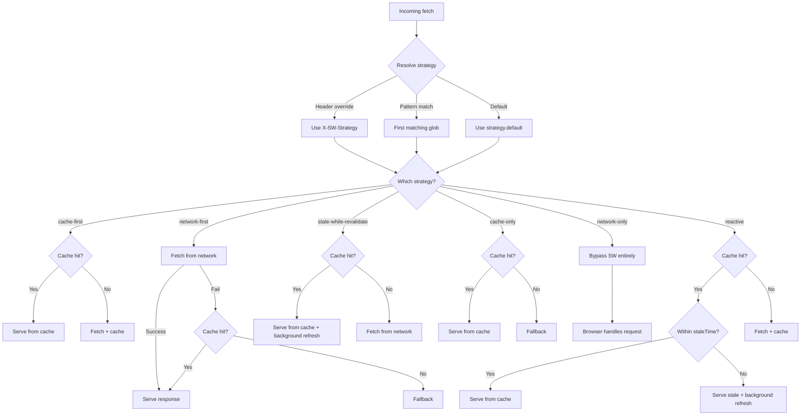

## Strategy resolution priority

The SW resolves which strategy to apply for each incoming fetch in this priority order:

1. **Header override** — `X-SW-Strategy` header on the request
2. **Pattern match** — first matching glob in `strategy.patterns`
3. **Default** — `strategy.default` value



URL patterns use glob syntax:

| Pattern       | Matches                                              |
| ------------- | ---------------------------------------------------- |
| `/api/*`      | `/api/notes`, `/api/users` (single segment)          |
| `/api/**`     | `/api/notes/123`, `/api/users/456/posts` (any depth) |
| `/static/*.js`| `/static/app.js`, `/static/vendor.js`                |
| `!/api/auth/**`| Negation — excludes auth routes                     |

## Strategy pipeline

All six strategies share the same core building blocks:

- **`serveFromCache(request)`** — looks up request in precache or runtime caches, with mode-specific rules for navigation requests
- **`_fetchWithTimeout(request)`** — pure fetch with `AbortController` timeout (no cache lookup, no ETag, no 304 handling)
- **`cacheResponse(response, request)`** — stores responses by content-type, skipping runtime when entry exists in precache
- **`fallback(request)`** — dispatches to `navFallback()` for navigation requests; returns **502 Bad Gateway** for all other subresources (images, scripts, API calls, etc.)
- **`navFallback(request)`** — the HTML fallback chain: precache → runtime-html (SSR only) → per-route → global fallback (SSR only) → inline 503

### Per-strategy flow

```
cache-first:
  → serveFromCache (if available)
  → fall back to _fetchWithTimeout on miss → cacheResponse

network-first:
  → _fetchWithTimeout → on failure → serveFromCache

stale-while-revalidate:
  → _fetchWithTimeout (background, non-blocking)
  → serveFromCache (stale allowed — return immediately)
  → on cache miss: wait for network or fallback

cache-only:
  → serveFromCache only (never hits network)

network-only:
  → _fetchWithTimeout only (no cache interaction)

reactive:
  → serveFromCache (if available)
  → shouldReactiveRefresh? → stale (past staleTime)? → queueRefresh(url)
  → also: refetchInterval timer, refetchOnFocus, refetchOnReconnect
    → all trigger refresh through queueRefresh when stale
```

### serveFromCache by mode

```
navigate + SPA:
  → check precache for FALLBACK_PATH → serve if found → null

navigate + SSR/default:
  → precache → runtime-html → null

non-navigate (any mode):
  → runtime cache → precache → null
```

### Cache rules

- `cacheResponse` always skips storing in runtime when entry exists in precache (precache is authoritative)
- Tags are recorded in IndexedDB for every cache write (runtime or precache)
- `_fetchWithTimeout` is a pure fetch + timeout — all caching decisions happen at the strategy level

## Reactive strategy

### staleTime model

Swoff's staleness model is different from a TTL eviction. It is scoped to a single explicit **reactive** strategy rather than spread across all strategies:

- **Fresh**: within `staleTime` seconds of being cached. The SW serves from cache immediately — no network request.
- **Stale**: past `staleTime`. The SW still serves the cached response, but triggers a **background refresh** (batched and rate-limited). The next request gets fresh data.

This means the user **never sees a loading spinner** for cached data. The response is always instant from cache; freshness is maintained in the background.

**staleTime is reactive-only.** It has no meaning on other strategies — each non-reactive strategy has its own simple, predictable contract:

| Strategy                 | Behavior                                                                                                                   |
| ------------------------ | -------------------------------------------------------------------------------------------------------------------------- |
| `cache-first`            | Serve from cache if available, fall back to network. No staleTime awareness.                                               |
| `network-first`          | Try network first, fall back to cache on failure. No staleTime awareness.                                                  |
| `stale-while-revalidate` | Serve from cache immediately + always background refresh on every request. Unconditional — no staleTime gate.              |
| `cache-only`             | Serve from cache only. Never hits the network.                                                                             |
| `network-only`           | Always hit the network. Never caches.                                                                                      |
| `reactive`               | Serve from cache. If stale (past `staleTime`), trigger a background refresh. Additionally, can auto-refetch on interval, window focus, or reconnect. |

The key insight: staleTime does not **evict** the entry. It makes the data **usable indefinitely** while keeping it fresh in the background. Background refreshes are batched (`features.refetchQueue.batchSize`) with rate limiting (`features.refetchQueue.batchDelayMs`) to avoid stampedes.

### Refresh triggers

The reactive strategy bundles three optional refresh triggers that all gate through `staleTime`:

| Trigger              | Description                                                | Gating                                 |
| -------------------- | ---------------------------------------------------------- | -------------------------------------- |
| `refetchInterval`    | Timer-based — re-fetches every N seconds in the background | Only fires if stale (past `staleTime`) |
| `refetchOnFocus`     | Fires when the tab regains focus (`visibilitychange`)      | Only fires if stale (past `staleTime`) |
| `refetchOnReconnect` | Fires when the browser comes back online                   | Only fires if stale (past `staleTime`) |

### Entry lifecycle

When a reactive match is found, the SW registers a reactive entry:

```ts
// Inside the SW — automatic
registerReactiveEntry(cacheKey, actualUrl, {
  staleTime: 30,
  refetchInterval: 60,
  refetchOnFocus: true,
  refetchOnReconnect: false,
});
```

The entry tracks the URL for automatic background refreshes. Intervals are cleaned up on SW deactivation.

```
Timeline:
  Request A  →  serve from network, cache, register reactive entry
  30s later  →  staleTime expires
  Request B  →  serve stale cache, queue background refresh
  Background →  fetch fresh, update cache
  Tab focus  →  refetchOnFocus triggers another refresh
```

## Navigation modes

Three modes control how navigation requests are served from cache and what happens when both cache and network fail.

### serveFromCache

Each mode follows its own lookup chain for navigation requests:

| Mode      | Steps                                                                               |
| --------- | ----------------------------------------------------------------------------------- |
| `spa`     | If `fallback` path configured and found in precache → serve it. Otherwise → `null`. |
| `ssr`     | Precache → runtime-html cache → `null`.                                             |
| `default` | Same as `ssr`.                                                                      |

For non-navigation requests (JS, CSS, API), the same three-step chain applies regardless of mode: runtime cache → precache (content-type must match Accept) → `null`. No branch decides to hit the network — `serveFromCache` returns a cached response or `null`. The **strategy** decides what to do next.

### Fallback chain

When the strategy exhausted all options (network failed + `serveFromCache` returned `null`), `fallback()` dispatches based on request type:

- **Navigation requests** (`sec-fetch-mode: navigate`) → delegates to `navFallback()`
- **SSR framework client-nav fetches** (Next.js RSC `text/x-component`, Remix `?_data`, SvelteKit `__data.json`) → delegates to `navFallback()`
- **All other subresources** (JS, CSS, images, API calls, fonts, etc.) → returns **502 Bad Gateway** with no HTML body

This prevents the old behavior of serving HTML offline pages for non-HTML requests, which caused rendering errors, corrupt asset imports, and broken API responses.

#### navFallback chain (HTML fallback, navigation only)

| Mode      | Fallback steps                                                                |
| --------- | ----------------------------------------------------------------------------- |
| `spa`     | precache → per-route rules → inline 503                                       |
| `ssr`     | precache → runtime-html → per-route rules → global fallback path → inline 503 |
| `default` | Same as `ssr`                                                                 |

The fallback levels broadcast to clients via `OFFLINE_FALLBACK_ACTIVATED`: `"route-fallback"`, `"offline-page"`, `"inline-503"`. The `"spa-shell"` level is no longer emitted — SPA shell is served directly from `serveFromCache()`, not from the fallback chain.

### SSR and auto-prefetch

The `"ssr"` navigation mode is designed for server-rendered applications (Next.js, Remix, Nuxt, SvelteKit, Astro, HTMX). Unlike the old architecture which required separate `navigateFirst` handlers, SSR mode now falls through to the global caching strategy like all other modes. The key differentiator is **auto-prefetch**:

When `"ssr"` mode is enabled, the generated `client-injector` code intercepts `history.pushState()` and `history.replaceState()` and calls `prefetchCache(url)` for each navigation. This ensures that when the user clicks a client-side link, the SW starts fetching the page in the background before the server responds. The next time the user refreshes or navigates to that page, the cached HTML is available instantly.

The interception is framework-agnostic — every client-side router ultimately calls `pushState`/`replaceState`. No framework-specific integration is needed.

All navigation modes use the same standard strategy dispatch for the actual fetch — the mode only controls `serveFromCache` lookup order and `navFallback()` chain depth.

## HTML cache isolation

A single URL can serve different content types depending on the request context — full page loads return `text/html` while client-side fetches may return `text/x-component` (RSC), `application/json`, or partial HTML. If these were stored at the same cache key, a hard refresh while offline could serve a non-HTML response to the browser.

Swoff isolates HTML responses in their own cache container (`CACHE_NAME_RUNTIME_HTML = "swoff-runtime-html"`). The `cacheResponse` function routes by Content-Type:

- `text/html` → `CACHE_NAME_RUNTIME_HTML` (HTML-only cache)
- Everything else (RSC, JSON, JS, CSS, images) → `CACHE_NAME_RUNTIME` (main runtime cache)
- If the URL already exists in **precache**, the entry is skipped (never stored in runtime) — precache takes precedence

This is framework-agnostic — the rule is simply: "HTML is special for navigation; everything else is normal."

There is no user-facing config — it is always enabled. Both caches participate in eviction, tag invalidation, activate handler cleanup, and online/focus reactive scans.

### RSC frameworks (Next.js, TanStack Start)

The `?_rsc=<token>` query param is safe to strip via `ignoreQueryParams: ["_rsc"]` — RSC payloads and HTML pages for the same URL are stored in different caches and never collide.

**Offline navigation behavior:**

| Scenario                                        | Result |
| ----------------------------------------------- | ------ |
| Refresh a previously full-loaded page (offline) | HTML cache hit ✓ |
| Refresh a page visited only via client-nav (offline) | HTML cache miss → 503 (RSC payload in main cache cannot serve as HTML) |
| First visit to SSG route (offline)              | Works if in `precacheRoutes` |
| Client navigation to visited page               | React's in-memory RSC cache (not SW) — works offline if same session |

**Limitations:** Pages never full-loaded cannot be refreshed offline. Dynamic pages require a successful full load to cache their HTML. React's in-memory RSC cache is per-session — a fresh tab or refresh requires the SW or network.

## 3-tier config resolution

The `strategy` field resolves through three priority levels:

1. **Per-request (highest)** — passed as options to `fetchWithCache({ strategy })` or `useSwoffFetch()`, or via `X-SW-Strategy` header
2. **Route pattern** — configured in `features.serviceWorker.strategy.patterns` keyed by URL pattern
3. **Global default (lowest)** — configured at `features.serviceWorker.strategy.default`

**Reactive-only fields** (`staleTime`, `refetchInterval`, `refetchOnReconnect`, `refetchOnFocus`) resolve through tiers:

| Field                | Tier 1 (per-request)                                          | Tier 2 (route pattern) | Tier 3 (global default)                  |
| -------------------- | ------------------------------------------------------------- | ---------------------- | ---------------------------------------- |
| `staleTime`          | ✅ `X-SW-Stale-Time` header or `fetchWithCache({ staleTime })` | ✅ pattern entry       | ✅ `reactive.staleTime`          |
| `refetchInterval`    | ❌ SW-initiated timer — not per-request                       | ✅ pattern entry       | ✅ `reactive.refetchInterval`    |
| `refetchOnReconnect` | ❌ SW-initiated — not per-request                             | ✅ pattern entry       | ✅ `reactive.refetchOnReconnect` |
| `refetchOnFocus`     | ❌ SW-initiated — not per-request                             | ✅ pattern entry       | ✅ `reactive.refetchOnFocus`     |

**Example resolution flow:**

- Request to `/api/todos` with strategy `"reactive"` → tier 1: `X-SW-Stale-Time` header? no → tier 2: `/api/*` has `staleTime: 30` → use 30s
- Request to `/api/posts` with strategy `"reactive"` (no route match) → tier 1: no header → tier 2: no pattern → tier 3: global `staleTime: 0` → use 0s (always stale)

## Decision Matrix

| Request type           | SPA (nav)                     | SSR / Default (nav)               | Any mode (subresource)          |
| ---------------------- | ----------------------------- | --------------------------------- | ------------------------------- |
| Reactive strategy      | network → navFallback         | cache → network → navFallback     | cache (fresh) → network → 502   |
| Network‑Only           | network → navFallback         | network → navFallback (cache OK)  | network → 502 (cache on OK)     |
| Network‑First          | network → navFallback         | cache → network → navFallback     | cache → network → 502           |
| Cache‑First            | network → navFallback         | cache → network (miss) → navFallback | cache → network (miss) → 502 |
| Stale‑While‑Revalidate | network (bg) + navFallback    | network (bg) + cache → navFallback | network (bg) + cache → 502      |

`navFallback` expands to the HTML chain above. Subresource `502` returns `new Response(null, { status: 502 })` — no HTML body is served for non-navigation requests.
