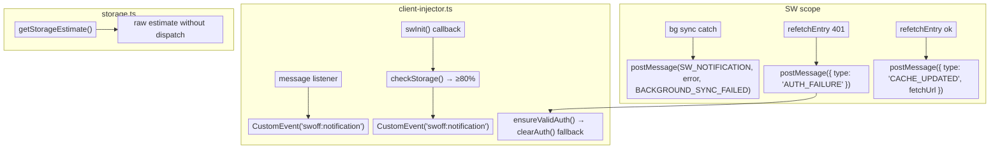

## Notifications & Resource Monitoring

Swoff broadcasts resource-level events from the Service Worker to the client window via a unified notification channel. This lets the app react to network failures, storage pressure, and background processing errors without polling.

### Architecture

### Fetch timeout

Every network request made by the SW passes through `_fetchWithTimeout()`, which wraps `fetch()` with an `AbortController` set to `features.serviceWorker.strategy.timeout` seconds (default 10). On timeout or network error:

1. The catch block broadcasts `SW_NOTIFICATION` (`FETCH_FAILED`) to all clients
2. The calling strategy naturally falls through to its cache fallback — no request is lost

This timeout applies uniformly across all strategies, ensuring no single slow request blocks the SW's fetch handler indefinitely.

### Storage quota awareness

`storage.ts` exposes `getStorageEstimate()` and `formatBytes()` — thin wrappers around `navigator.storage.estimate()`. The former is a pure utility for rendering quota in the UI (e.g. `useSwoffStorage()` React hook). The storage check runs inside `client-injector.ts` after SW initialization and dispatches `CustomEvent("swoff:notification")` when `percentUsed` exceeds the configured threshold.

**Threshold:** Configurable via `features.serviceWorker.strategy.storageThreshold` — defaults to **80%**. Set to any value between 0 and 100 to change when the warning fires.

### Why a unified channel?

Rather than one CustomEvent per failure type (`swoff:fetch-failed`, `swoff:precache-failed`, etc.), a single `swoff:notification` event with a `code` discriminator keeps the API surface small and makes it trivial to wire up a toast/notification library.

> See the [Library Comparison](/docs/comparisons#tier-1-sw-toolkits) for resource monitoring comparison against Workbox, TanStack Query, and client databases.
