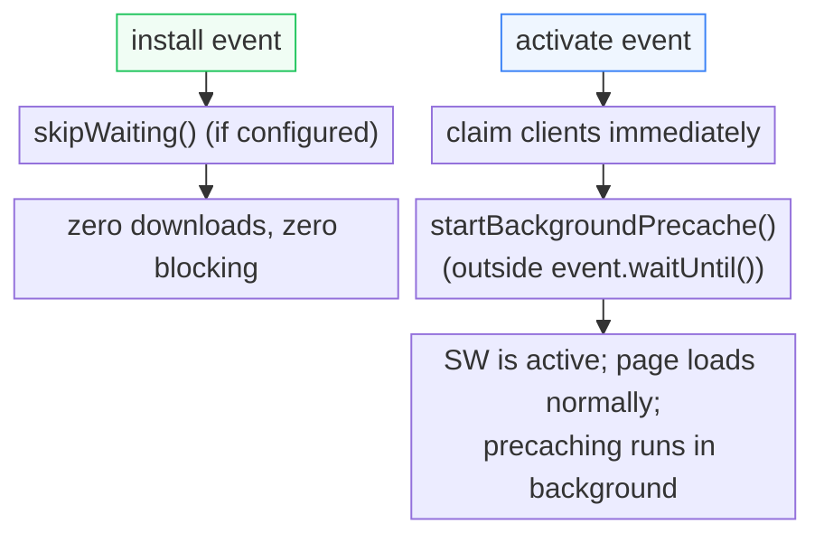

## What precaching means

Precaching downloads assets (HTML, JS, CSS, images, fonts) into the Cache Storage API during the SW lifecycle so they're available offline immediately — no network request needed for subsequent visits. This is distinct from _runtime caching_, which caches responses on-demand as the user interacts with the app.

Swoff's approach differs from other tools: instead of blocking the install event, precaching starts after activation and runs in the background.

## Background activation-first



By running `startBackgroundPrecache()` outside `event.waitUntil()`, the activate event completes immediately and the SW starts controlling the page. Precaching continues as an independent task — the user sees the app load without waiting for assets to download.

## IndexedDB checkpoint system

The SW maintains progress in an IndexedDB database (`swoff-precache`, store `progress`) with two keys:

| Key                | Value                      | Purpose                                             |
| ------------------ | -------------------------- | --------------------------------------------------- |
| `precache-version` | Content hash of asset list | Detects when the asset list changed between deploys |
| `checkpoint`       | Integer index              | Number of assets successfully cached so far         |

The resume flow:

1. Compute a hash of the current `ASSETS_TO_CACHE` array
2. If the hash differs from the stored `precache-version`, reset the checkpoint to 0 (asset list changed — re-cache everything)
3. Read the `checkpoint` — skip already-cached assets up to that index
4. Process remaining assets in configurable batches
5. On each fully successful batch, advance the checkpoint in IndexedDB
6. On completion, set checkpoint to total

If the SW is terminated mid-precaching (browser close, navigate away, SW killed), the next activation reads the checkpoint and resumes from the last successful batch — no re-downloads.

## Per-batch progress reporting

After each batch completes, the SW broadcasts `SW_PROGRESS` to all connected clients:

```ts
{
  type: "SW_PROGRESS",
  percent: 42,      // 0–100, based on attempted (not just downloaded)
  downloaded: 15,   // count of assets actually in cache
  total: 36,        // total assets to cache
}
```

The client-injector relays this as a DOM event:

```ts
window.addEventListener("sw-progress", (e) => {
  // e.detail.percent — 0 to 100
  // e.detail.downloaded — assets cached so far
  // e.detail.total — total remaining
});
```

Progress uses `attempted` (work started) rather than `downloaded` alone, so the percentage accurately reflects progress even when assets are already cached from a previous attempt.

## Client-initiated resume

The client-injector automatically sends `RESUME_PRECACHE` to the SW when:

- The tab becomes visible (`visibilitychange` → `"visible"`)
- The browser comes back online (`online` event)

This ensures precaching progresses even if the user navigates away mid-precache or closes and reopens the tab.

## Version-aware checkpoint

Every deploy changes the asset URL list. The `precache-version` key detects this via a content-based hash of the `ASSETS_TO_CACHE` array. When the version changes, the checkpoint resets to 0 automatically — the SW re-caches from scratch without manual intervention.

## Reset protocol

Send a `RESET_CACHE` message to the SW to trigger a complete re-precache:

```ts
if (navigator.serviceWorker.controller) {
  const channel = new MessageChannel();
  channel.port1.onmessage = (e) => {
    if (e.data.type === "RESET_CACHE_COMPLETE") {
      console.log("All caches cleared, precache restarted");
    }
  };
  navigator.serviceWorker.controller.postMessage({ type: "RESET_CACHE" }, [
    channel.port2,
  ]);
}
```

This deletes all caches, resets the checkpoint to 0, and restarts precaching from the beginning. Useful for debugging or when the user wants a full re-cache without re-registering the SW.
