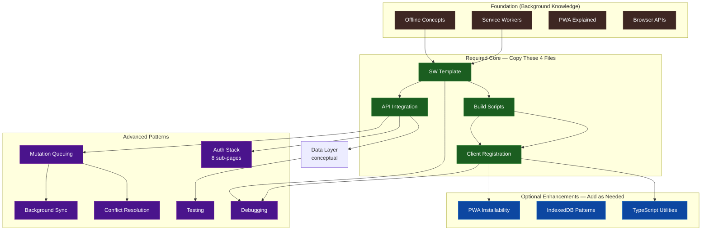

## Modular by Design

Swoff is a **toolbox**, not a framework. Every feature is a file you copy into your project and own.

<Cards>
  <Card title="Pick what you need" icon={<CheckIcon />}>
    Don't need push notifications? Skip the file. Each feature is independent or
    has minimal, clear dependencies.
  </Card>
  <Card title="Tweak everything" icon={<SlidersIcon />}>
    The code is yours. Change caching strategies, swap IndexedDB wrappers, or
    rewrite the merge logic — no library fights you.
  </Card>
  <Card title="Zero lock-in" icon={<UnlinkIcon />}>
    Walk away any time. There's no npm install to undo — just delete the files
    you don't need anymore.
  </Card>
</Cards>

## Feature Categories

Features are grouped into three tiers matching the dependency diagram below.

### Required Core

<Cards>
  <Card
    title="SW Template"
    icon={<FileCodeIcon className="text-emerald-500" />}
    href="/docs/patterns/sw-template"
  >
    Versioned service worker with cache-first, stale-while-revalidate, and
    network-first strategies. Tag-based invalidation. Cross-tab broadcast.
  </Card>
  <Card
    title="Build Scripts"
    icon={<HammerIcon className="text-emerald-500" />}
    href="/docs/patterns/build-scripts"
  >
    Reads package.json version, replaces placeholders in SW template, outputs
    versioned SW + version.json.
  </Card>
  <Card
    title="Client Registration"
    icon={<UserPlusIcon className="text-emerald-500" />}
    href="/docs/patterns/client-registration"
  >
    Fetches version.json, compares stored version, shows update prompt on
    mismatch. Supports deferred and forced updates.
  </Card>
  <Card
    title="API Integration"
    icon={<PlugIcon className="text-emerald-500" />}
    href="/docs/patterns/api-integration"
  >
    Fetch wrapper with cache strategy headers, query deduplication, tag
    invalidation, and cross-tab sync.
  </Card>
</Cards>

### Optional Enhancements

<Cards>
  <Card
    title="PWA Installability"
    icon={<DownloadIcon className="text-blue-500" />}
    href="/docs/patterns/pwa-installability"
  >
    Manifest JSON, install prompt handler, PWA mode detection, and app icons.
  </Card>
  <Card
    title="IndexedDB Patterns"
    icon={<DatabaseIcon className="text-blue-500" />}
    href="/docs/patterns/indexeddb-patterns"
  >
    DB setup, CRUD, indexed queries, soft deletes, schema migrations, and
    storage quota management.
  </Card>
  <Card
    title="TypeScript Declarations"
    icon={<WrenchIcon className="text-blue-500" />}
    href="/docs/patterns/client-registration#typescript-declarations"
  >
    Type declarations for SW window properties and checkForUpdate helper.
  </Card>
</Cards>

### Advanced Patterns

<Cards>
  <Card
    title="Mutation Queuing"
    icon={<WorkflowIcon className="text-purple-500" />}
    href="/docs/advanced/mutation-queuing"
  >
    Queues offline writes in IndexedDB, auto-syncs on reconnect, reconciles
    temp IDs.
  </Card>
  <Card
    title="Background Sync"
    icon={<RefreshCwIcon className="text-purple-500" />}
    href="/docs/advanced/background-sync"
  >
    Processes mutation queue after tab close via Background Sync API
    (Chrome/Edge).
  </Card>
  <Card
    title="Push Notifications"
    icon={<BellIcon className="text-purple-500" />}
    href="/docs/advanced/push-notifications"
  >
    Subscribe to push, handle notifications in the SW, and integrate with your
    data layer.
  </Card>
  <Card
    title="Conflict Resolution"
    icon={<GitMergeIcon className="text-purple-500" />}
    href="/docs/advanced/conflict-resolution"
  >
    Five strategies for multi-user offline edits: LWW, server wins, custom
    merge, manual, CRDT.
  </Card>
  <Card
    title="Auth Stack"
    icon={<ShieldIcon className="text-purple-500" />}
    href="/docs/advanced/authentication"
  >
    Token storage, auth-aware fetch, current user cache, SW integration,
    offline state, lock screen.
  </Card>
  <Card
    title="Testing"
    icon={<BugIcon className="text-purple-500" />}
    href="/docs/advanced/testing"
  >
    Vitest + fake-indexeddb + Playwright test patterns for SW, IndexedDB,
    mutation queue, and offline behavior.
  </Card>
  <Card
    title="Debugging"
    icon={<SearchIcon className="text-purple-500" />}
    href="/docs/advanced/debugging"
  >
    DevTools walkthrough, postMessage monitoring, and troubleshooting tables
    for common failure modes.
  </Card>
</Cards>

## Swoff vs Traditional PWA Libraries

| Feature      | Swoff                      | Traditional PWA Libraries          |
| ------------ | -------------------------- | ---------------------------------- |
| Dependencies | Zero runtime deps          | npm packages                       |
| Control      | You own the code           | Library updates can break your app |
| Updates      | Consent-based, versioned   | Often automatic                    |
| Offline      | Guaranteed by architecture | Depends on library                 |
| Framework    | Agnostic                   | Often framework-specific           |

## Feature Map

The diagram below shows every feature Swoff provides and how they relate. Required features are in green, optional add-ons in blue, and advanced in purple.

## Feature Reference

### Required Core

These four files form the backbone of every Swoff app. Copy them in order.

| Feature                                                   | File                                        | What it does                                                                                                                                         | Customize                                                                      |
| --------------------------------------------------------- | ------------------------------------------- | ---------------------------------------------------------------------------------------------------------------------------------------------------- | ------------------------------------------------------------------------------ |
| [SW Template](/docs/patterns/sw-template)                 | `swoff/sw-template.js`                      | Versioned service worker with cache-first, stale-while-revalidate, and network-first strategies. Tag-based invalidation system. Cross-tab broadcast. | Caching strategy per route, cache names, asset list, stale TTL, max cache size |
| [Build Scripts](/docs/patterns/build-scripts)             | `swoff/sw-generator.js`                     | Reads `package.json` version, replaces placeholders in SW template, outputs versioned SW + `version.json`.                                           | Output directory, template path, version source                                |
| [Client Registration](/docs/patterns/client-registration) | `swoff/sw-injector.js`                      | Fetches `version.json`, compares stored version, shows update prompt on mismatch. Supports deferred and forced updates.                              | Update prompt UI, deferred registration logic, min supported version           |
| [API Integration](/docs/patterns/api-integration)         | `swoff/fetch-wrapper.js` + `swoff/cache.js` | Fetch wrapper with cache strategy headers, query deduplication, tag invalidation, cross-tab sync.                                                    | Endpoint strategy mapping, dedup window, invalidation triggers                 |

### Optional Enhancements

Add these when you need them — no feature requires all of them.

| Feature                                                 | Adds                                                                                       | Customize                                                                                             |
| ------------------------------------------------------- | ------------------------------------------------------------------------------------------ | ----------------------------------------------------------------------------------------------------- |
| [PWA Installability](/docs/patterns/pwa-installability) | Manifest JSON, install prompt handler, PWA mode detection, app icons                       | Icon sizes, install prompt behavior, display mode                                                     |
| [IndexedDB Patterns](/docs/patterns/indexeddb-patterns) | DB setup, CRUD, indexed queries, soft deletes, schema migrations, storage quota management | DB name, store schema, migration steps, storage thresholds (80%/95%), use native API or `idb` wrapper |
| [TypeScript Utilities](/docs/patterns/client-registration#typescript-declarations)        | Type declarations for SW window properties, `checkForUpdate()` helper                      | Type definitions, helper function behavior                                                            |

### Advanced Patterns

Solve specific production needs. Each depends on the required core but is independent of other advanced features.

| Feature                                                   | Depends On                                        | What it does                                                                                                 | Customize                                                                          |
| --------------------------------------------------------- | ------------------------------------------------- | ------------------------------------------------------------------------------------------------------------ | ---------------------------------------------------------------------------------- |
| [Mutation Queuing](/docs/advanced/mutation-queuing)       | API Integration, IndexedDB Patterns               | Queues offline writes (POST/PUT/DELETE) in IndexedDB, auto-syncs on reconnect, reconciles temp IDs           | Retry count, queue schema, sync triggers, rollback behavior                        |
| [Background Sync](/docs/advanced/background-sync)         | Mutation Queuing                                  | Processes mutation queue after tab close via Background Sync API (Chrome/Edge)                               | Sync registration strategy, SW-side queue processing, retry re-registration        |
| [Conflict Resolution](/docs/advanced/conflict-resolution) | Mutation Queuing                                  | Five strategies for multi-user offline edits: LWW, server wins, custom merge, manual merge (three-way), CRDT | Merge function per field, conflict UI, `$conflict` tracking                        |
| [Auth Stack](/docs/advanced/authentication)               | API Integration                                   | Token storage, auth-aware fetch, current user cache, SW auth integration, offline auth state, lock screen    | Storage tier (memory vs IndexedDB), auth library type, 401 handling, token refresh |
| [Testing](/docs/advanced/testing)                         | Data Layer, API Integration                       | Vitest + fake-indexeddb + Playwright test patterns for SW, IndexedDB, mutation queue, offline behavior       | Test coverage scope, mock implementations, CI integration                          |
| [Debugging](/docs/advanced/debugging)                     | SW Template, Client Registration, API Integration | DevTools walkthrough, postMessage monitoring, troubleshooting tables for common failure modes                | NA — reference guide                                                               |

## Build Your Stack

Swoff's modular design lets you start minimal and add complexity as needed.

<Accordions type="multiple">
  <Accordion title="Minimal — Versioned SW Updates Only">
    <table>
      <tr>
        <th>Feature</th>
        <th>Files</th>
        <th>Use case</th>
      </tr>
      <tr>
        <td>SW Template</td>
        <td>
          <code>sw-template.js</code>
        </td>
        <td rowspan="3">
          You already have an app and just want consent-based, versioned SW
          updates. No offline data, no PWA.
        </td>
      </tr>
      <tr>
        <td>Build Scripts</td>
        <td>
          <code>sw-generator.js</code>
        </td>
      </tr>
      <tr>
        <td>Client Registration</td>
        <td>
          <code>sw-injector.js</code>
        </td>
      </tr>
    </table>
  </Accordion>
  <Accordion title="Standard — Offline-First with Cached Reads">
    <table>
      <tr>
        <th>Feature</th>
        <th>Files</th>
        <th>Use case</th>
      </tr>
      <tr>
        <td>Minimal stack</td>
        <td>3 files above</td>
        <td rowspan="3">
          Your app reads data from an API and you want it to work offline.
          Writes go through when online.
        </td>
      </tr>
      <tr>
        <td>API Integration</td>
        <td>
          <code>fetch-wrapper.js</code> + <code>cache.js</code>
        </td>
      </tr>
      <tr>
        <td>IndexedDB Patterns</td>
        <td>Your own DB layer</td>
      </tr>
    </table>
  </Accordion>
  <Accordion title="Full Offline — Queued Writes with Reconciliation">
    <table>
      <tr>
        <th>Feature</th>
        <th>Files</th>
        <th>Use case</th>
      </tr>
      <tr>
        <td>Standard stack</td>
        <td>5 files above</td>
        <td rowspan="3">
          Users create/edit/delete data offline. Mutations queue, sync on
          reconnect, and resolve conflicts automatically.
        </td>
      </tr>
      <tr>
        <td>Mutation Queuing</td>
        <td>
          <code>mutation-queue.js</code> + <code>reconcile.js</code>
        </td>
      </tr>
      <tr>
        <td>Conflict Resolution</td>
        <td>
          <code>conflict.js</code> + <code>merge.js</code>
        </td>
      </tr>
    </table>
  </Accordion>
  <Accordion title="Full Offline + Auth">
    <table>
      <tr>
        <th>Feature</th>
        <th>Files</th>
        <th>Use case</th>
      </tr>
      <tr>
        <td>Full Offline stack</td>
        <td>7+ files above</td>
        <td rowspan="2">
          Full offline app with authentication, token management, and lock
          screen for sensitive data.
        </td>
      </tr>
      <tr>
        <td>Auth Stack</td>
        <td>
          5+ files under <code>swoff/auth/</code>
        </td>
      </tr>
    </table>
  </Accordion>
</Accordions>

## Customization Examples

Every Swoff feature is designed to be modified.

<Cards>
  <Card title="Change a caching strategy" icon={<ShuffleIcon />}>
    In <code>sw-template.js</code>, modify the fetch handler to use
    <code>NetworkFirst</code> for API routes instead of <code>CacheFirst</code>.
  </Card>
  <Card title="Swap IndexedDB wrappers" icon={<DatabaseIcon />}>
    Start with native IndexedDB, later switch to the <code>idb</code> library —
    only the DB utility functions change, not your app logic.
  </Card>
  <Card title="Custom merge logic" icon={<GitMergeIcon />}>
    In <code>conflict.js</code>, write a per-field merge function — e.g.,
    <code>title: serverWins, completed: localOrServer, tags: union</code>.
  </Card>
  <Card title="Replace the update prompt" icon={<BellIcon />}>
    The <code>sw-update-available</code> event lets you build any UI — toast,
    modal, banner, or auto-update.
  </Card>
  <Card title="Add more retries" icon={<RotateCwIcon />}>
    In <code>mutation-queue.js</code>, bump <code>MAX_RETRIES</code> from 5 to 10,
    or implement exponential backoff.
  </Card>
  <Card title="Scope auth to cookie-based" icon={<ShieldIcon />}>
    Edit <code>withAuthHeaders()</code> in <code>auth-fetch.js</code> to be a
    no-op when using cookie/session auth.
  </Card>
</Cards>

## Next Steps

- Start with the [Introduction](/docs/introduction) if you haven't already
- Learn the [concepts](/docs/concepts/what-is-offline-and-sw) — offline capability and service workers
- Follow the [Core Architecture](/docs/core/offline-architecture) design
- Copy the [required patterns](/docs/patterns/) in order

import { CheckIcon, SlidersIcon, UnlinkIcon, FileCodeIcon, HammerIcon, UserPlusIcon, PlugIcon, DownloadIcon, DatabaseIcon, WrenchIcon, WorkflowIcon, RefreshCwIcon, BellIcon, GitMergeIcon, ShieldIcon, BugIcon, SearchIcon, ShuffleIcon, RotateCwIcon } from "lucide-react";
