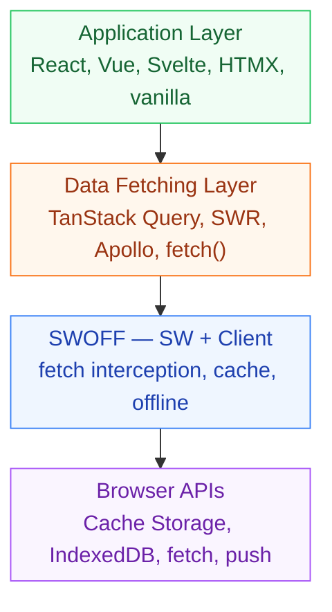

Swoff operates at the **`fetch` event** + **Service Worker** layer — below the application and data-fetching layers. This makes it compatible with any web stack regardless of backend language, frontend framework, or rendering strategy.



The only framework-specific surface is **view adapters** (React hooks, Vue composables, future Svelte). These are optional thin wrappers over `postMessage` to the SW. The core caching, offline, invalidation, and auth work without them.

## Compatible with everything

| Category                   | Examples                                                    | Config Hint                                                                      |
| -------------------------- | ----------------------------------------------------------- | -------------------------------------------------------------------------------- |
| **Backend**                | PHP, Laravel, Django, Flask, Rails, ASP.NET, Go, Java, Node | `navigation.mode: "default"`                                                     |
| **HTML-over-wire**         | HTMX, Turbo Hotwire, Unpoly, Livewire                       | `navigation.mode: "ssr"`                                                         |
| **SSG**                    | Astro, VitePress, Hugo, 11ty, Jekyll                        | `navigation.mode: "default"`, strategy `cache-first`                             |
| **SPA frameworks**         | React, Vue, Svelte, Solid, Angular, Alpine                  | `navigation.mode: "spa"` (default)                                               |
| **Meta-frameworks**        | Next.js, Remix, Nuxt, Quasar, SvelteKit, TanStack Start     | Auto-detected; `navigation.mode: "ssr"` + framework-specific `ignoreQueryParams` |
| **RSC-based**              | Next.js App Router                                          | `navigation.mode: "ssr"` + `ignoreQueryParams: ["_rsc"]` (auto-detected)         |
| **Edge / Serverless**      | Cloudflare Workers, Deno Deploy, Vercel Edge                | Edge runs on CDN, Swoff runs in browser — independent layers, no conflict        |
| **Islands / Resumability** | Astro islands, Qwik, Marko                                  | SW runs in its own thread regardless of component hydration                      |

## No package.json required

Swoff needs Node.js only for the **toolchain** — the CLI (`@swoff/cli`) generates your files and the build script produces the final service worker. The generated output is plain JavaScript. The SW filename is always `sw.js` (no version appended), and version mode defaults to `"hash"` which needs no `package.json`. Your production app does not need Node.js, npm, or a `package.json`.

### Workflow for any project

```bash
# 1. Generate config (no package.json needed)
npx @swoff/cli init --framework no-bundler

# 2. Generate all files
npx @swoff/cli generate

# 3. Build the final service worker
node swoff/sw/generator.mjs

# 4. Include in your HTML
<script src="/swoff/client-injector.bundle.js"></script>
```

The generated files in `swoff/` are static — serve them however you serve your other assets.

### CI / Docker integration

For non-JS projects, add the Swoff generator to your Makefile or CI pipeline:

```makefile
# Makefile
build:
	composer install            # or pip install, go build, bundle install
	npx @swoff/cli generate
	node swoff/sw/generator.mjs  # final SW output
	# swoffPath in config controls where files land; no copy needed
```

In Docker, Node.js is only needed in the build stage:

```dockerfile
# Multi-stage Docker build
FROM node:20-alpine AS swoff-build
WORKDIR /app
RUN npx @swoff/cli init --framework no-bundler \&\& npx @swoff/cli generate
RUN node swoff/sw/generator.mjs

FROM php:8.2-apache AS runtime
COPY --from=swoff-build /app/swoff /var/www/html/swoff
COPY --from=swoff-build /app/swoff.config.json /var/www/html/
# Your PHP app code, composer install, etc.
# swoffPath in config controls where files land inside the runtime image
```

The final image contains only static JS files — no Node.js runtime required in production.

### Per-ecosystem examples

| Stack                                                                  | How to serve generated files                                                                          | Guide                                              |
| ---------------------------------------------------------------------- | ----------------------------------------------------------------------------------------------------- | -------------------------------------------------- |
| **No-bundler (Go, Laravel, Django, Flask, Rails, PHP, plain HTML/JS)** | Serve from your public/static directory and include `<script src="/swoff/client-injector.bundle.js">` | [No-bundler guide](/docs/frameworks/no-bundler)    |
| **HTMX**                                                               | Include `<script>` tag, control via `hx-headers`                                                      | [HTMX guide](/docs/frameworks/htmx/adapters)       |
| **Plain HTML / Static**                                                | Serve from document root and reference with a `<script>` tag                                          | [Vanilla guide](/docs/frameworks/vanilla/adapters) |

## Related

- [Navigation caching: modes, fallback, preload](/docs/guides#navigation)
- [Framework integration: per-ecosystem config](/docs/frameworks/ecosystem)
- [Architecture: HTML cache isolation](/docs/architecture/caching#html-cache-isolation)
- [Library comparison](/docs/comparisons)
