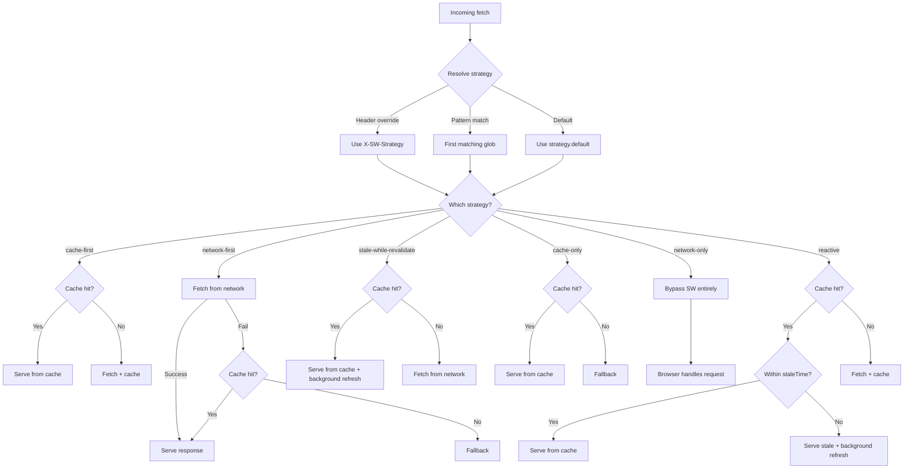

Swoff provides 6 caching strategies that run in the Service Worker. Every fetch event is intercepted, matched against your configured patterns, and handled by the appropriate strategy — no manual route registration needed.

## Preconditions

- Service worker registered and controlling the page (see [Service Worker guide](/docs/guides/service-worker))

## Status

**Already on by default.** After `swoff init`, the generated SW applies these default patterns:

| Pattern     | Strategy        | Behavior                                            |
| ----------- | --------------- | --------------------------------------------------- |
| `/api/*`    | `network-first` | Try network, fall back to cache                     |
| `/static/*` | `cache-first`   | Serve from cache on hit, fetch from network on miss |

## The 6 strategies

```json
{
  "features": {
    "serviceWorker": {
      "strategy": {
        "default": "cache-first",
        "patterns": {
          "/api/*": "network-first",
          "/static/*": "cache-first"
        },
        "timeout": 10,
        "reactive": {
          "defaults": {
            "staleTime": 0,
            "refetchInterval": 0,
            "refetchOnReconnect": false,
            "refetchOnFocus": false
          }
        }
      }
    }
  }
}
```

| Strategy                 | How it decides                                                                                                                                                      | Best for                                        |
| ------------------------ | ------------------------------------------------------------------------------------------------------------------------------------------------------------------- | ----------------------------------------------- |
| `cache-first`            | Cache hit → serve from cache. Cache miss → fetch and cache. No background refresh.                                                                                  | Static assets (JS, CSS, images)                 |
| `network-first`          | Fetch from network first. Network fails or times out → serve from cache. Cache miss → fallback.                                                                     | API responses that need freshness               |
| `stale-while-revalidate` | Cache hit (fresh or stale) → serve from cache + always trigger background refresh. Cache miss → fetch normally.                                                     | Content that can serve slightly stale data      |
| `cache-only`             | Cache hit → serve from cache. Never fetches from network. Cache miss → fallback.                                                                                    | Immutable assets, precached content             |
| `network-only`           | Bypasses SW entirely (early return). Browser handles the request directly. Never cached.                                                                            | Non-cacheable requests, analytics beacons       |
| `reactive`               | Cache hit + fresh (within `staleTime`) → serve. Cache hit + stale → serve + background refresh. Cache miss → fetch and cache. Refreshes only when past `staleTime`. | Dashboard data, polling, focus/refetch patterns |

## How each strategy decides

Each strategy follows a different pipeline — when to hit the network, when to serve from cache, and when to fall back:



## The strategy is resolved in this priority order:

- **Header override** — `X-SW-Strategy` header on the request
- **Pattern match** — first matching glob in `strategy.patterns`
- **Default** — `strategy.default` value

### 1. Default strategy

The default strategy is used when no pattern matches or a header override is present.

### 2. Pattern matching

URL patterns use glob syntax:

| Pattern         | Matches                                              |
| --------------- | ---------------------------------------------------- |
| `/api/*`        | `/api/notes`, `/api/users` (single segment)          |
| `/api/**`       | `/api/notes/123`, `/api/users/456/posts` (any depth) |
| `/static/*.js`  | `/static/app.js`, `/static/vendor.js`                |
| `!/api/auth/**` | Negation — excludes auth routes                      |

Patterns can be a strategy name string or an object with per-route overrides:

```json
{
  "patterns": {
    "/api/notes": {
      "strategy": "reactive",
      "staleTime": 30,
      "refetchInterval": 60,
      "refetchOnFocus": true
    },
    "/api/search/*": {
      "strategy": "network-first",
      "timeout": 5
    }
  }
}
```

Per-route overrides:

| Option               | Type    | Default                                | Description                                             |
| -------------------- | ------- | -------------------------------------- | ------------------------------------------------------- |
| `timeout`            | number  | `strategy.timeout`                     | Fetch timeout in seconds                                |
| `staleTime`          | number  | `reactive.defaults.staleTime`          | Seconds before cached response is stale (reactive only) |
| `refetchInterval`    | number  | `reactive.defaults.refetchInterval`    | Poll interval in seconds (reactive only)                |
| `refetchOnFocus`     | boolean | `reactive.defaults.refetchOnFocus`     | Refetch when tab regains focus (reactive only)          |
| `refetchOnReconnect` | boolean | `reactive.defaults.refetchOnReconnect` | Refetch when network returns (reactive only)            |

### 3. Request-level overrides

The third priority — a per-request header that bypasses all config. The client can override strategy behavior at call time via `fetchWithCache` options:

```ts
import { fetchWithCache } from "./swoff/fetch/core";

// Override strategy for this request
const { response } = await fetchWithCache("/api/notes", {
  strategy: "reactive",
  staleTime: 30,
  refetchInterval: 60,
  refetchOnFocus: true,
  refetchOnReconnect: true,
});
```

```ts
// Per-request header override — bypasses all pattern matching and default strategy
fetch("/api/notes", {
  headers: { "X-SW-Strategy": "stale-while-revalidate" },
});
```

These values are sent as headers (`X-SW-Strategy`, `X-SW-Stale-Time`, `X-SW-Refetch-Interval`, `X-SW-Refetch-On-Focus`, `X-SW-Refetch-On-Reconnect`) and are read by the SW's `determineCacheStrategy`. The `refetch*` and `staleTime` options only apply to the `reactive` strategy — other strategies ignore them.

## Reactive strategy deep dive

The reactive strategy implements stale-while-revalidate with staleness awareness via the `X-SW-Cached-At` header. Unlike plain `stale-while-revalidate` (which always refreshes), reactive only refreshes when the cached response is past `staleTime`. It also supports timer-based polling and focus/reconnect triggers.

### 1. How it works

1. On first request, the response is fetched from network and cached
1. On subsequent requests within `staleTime`, the cached response is served immediately
1. After `staleTime` elapses, the cached response is still served but a background refresh is queued
1. If `refetchInterval` is set, background refreshes happen on a timer
1. If `refetchOnFocus` is set, a refresh is triggered when the tab regains focus
1. If `refetchOnReconnect` is set, a refresh is triggered when the network comes back

```
Timeline:
  Request A  →  serve from network, cache, register reactive entry
  30s later  →  staleTime expires
  Request B  →  serve stale cache, queue background refresh
  Background →  fetch fresh, update cache
  Tab focus  →  refetchOnFocus triggers another refresh
```

### 2. Reactive entry lifecycle

When a reactive strategy match is found, the SW registers a reactive entry:

```ts
// Inside the SW — automatic
registerReactiveEntry(cacheKey, actualUrl, {
  staleTime: 30,
  refetchInterval: 60,
  refetchOnFocus: true,
  refetchOnReconnect: false,
});
```

The entry tracks the URL for automatic background refreshes. Intervals are cleaned up on SW deactivation.

### 3. Reactive defaults

```json
{
  "reactive": {
    "defaults": {
      "staleTime": 0,
      "refetchInterval": 0,
      "refetchOnReconnect": false,
      "refetchOnFocus": false
    }
  }
}
```

Setting `staleTime: 0` means every request after the first one is considered stale and triggers a background refresh while serving the cached response.

## Other strategy config fields

### 1. Timeout

The global `timeout` setting (default 10s) applies to all fetch requests from the SW. If a fetch doesn't respond within this time, the strategy's fallback logic kicks in (e.g., `network-first` would return cached content).

### 2. Cache eviction

Runtime caches have automatic eviction controlled by `maxRuntimeCacheAge` (default 30 days). Entries older than this are pruned during the `activate` event.

```json
{
  "strategy": {
    "maxRuntimeCacheAge": 2592000,
    "clearRuntimeOnUpdate": false
  }
}
```

Set `clearRuntimeOnUpdate: true` to wipe all runtime caches when a new SW version activates.

### 3. Cache key normalization

```json
{
  "strategy": {
    "normalizeKey": false,
    "ignoreQueryParams": ["_rsc"]
  }
}
```

- `ignoreQueryParams` — strips specified query params from the cache key (e.g., `_rsc` for Next.js RSC payloads)
- `normalizeKey` — sorts query params alphabetically before hashing the cache key

## Related

- [Service Worker fundamentals: versioning, lifecycle, registration](/docs/guides/service-worker)
- [Data fetching: fetchWithCache, prefetchCache](/docs/guides/data-fetching)
- [Navigation caching: SPA/SSR modes, preloading, fallback](/docs/guides/navigation-caching)
- [Config reference: strategy patterns](/docs/config#featuresserviceworkerstrategy)
