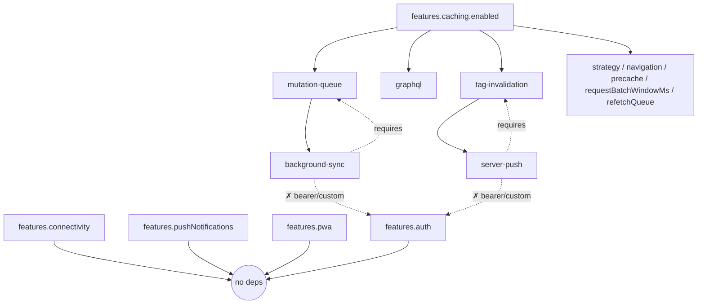
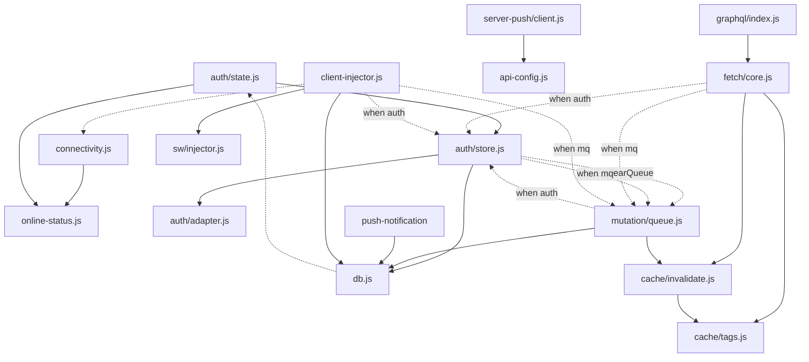

Swoff is the most comprehensive offline web infrastructure for any tech stack with zero runtime dependencies.

```bash
npx @swoff/cli init
npx @swoff/cli generate
```

import {
  BookOpenIcon,
  CodeIcon,
  CogIcon,
  TerminalIcon,
  SettingsIcon,
  CableIcon,
} from "lucide-react";

<Cards>
  <Card
    title="Integration Guides"
    icon={<BookOpenIcon />}
    href="/docs/guides"
  >
    SW, caching, auth, offline mutations — step by step.
  </Card>
  <Card
    title="API Reference"
    icon={<CodeIcon />}
    href="/docs/api"
  >
    Generated API: fetch, cache, mutation, auth, push, storage.
  </Card>
  <Card
    title="Architecture"
    icon={<CogIcon />}
    href="/docs/architecture"
  >
    Design decisions, hybrid model, data sync internals.
  </Card>
  <Card
    title="CLI Reference"
    icon={<TerminalIcon />}
    href="/docs/cli"
  >
    CLI commands, generation workflow, output layout.
  </Card>
  <Card
    title="Config Reference"
    icon={<SettingsIcon />}
    href="/docs/config"
  >
    Full swoff.config.json schema and feature flags.
  </Card>
  <Card
    title="Framework Integration"
    icon={<CableIcon />}
    href="/docs/frameworks"
  >
    Per-ecosystem setup: React, vanilla, no-bundler, HTMX.
  </Card>
</Cards>




